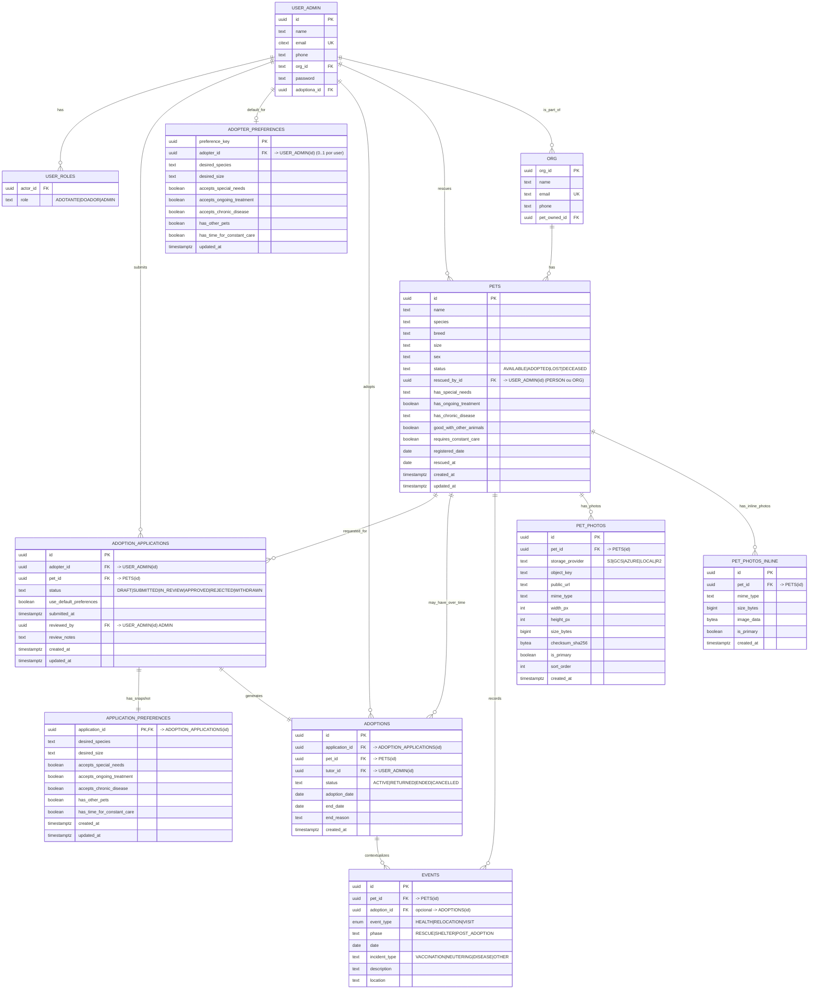

# Banco de Dados — Documentação Técnica (PostgreSQL + Flyway)

> Projeto: Adoção de Pets  
> Público: devs backend/frontend, QA e DBAs  
> Objetivo: explicar **o modelo de dados**, **regras de integridade**, **mutações via Flyway (V1/V2)**, **padrões de uso** e **exemplos**.

---

## 1) Visão Geral

O banco modela:
- **Usuários (USER_ADMIN)** — adotantes, doadores e admins (papéis em `USER_ROLES`).
- **ONGs (ORG)** — entidades que podem listar pets.
- **Pets (PETS)** — animais listados por pessoa física (user) ou ONG.
- **Aplicações de adoção (ADOPTION_APPLICATIONS)** — pedido formal para adotar um pet.
- **Adoções (ADOPTIONS)** — efetivação da adoção a partir de uma aplicação.
- **Eventos (EVENTS)** — histórico de saúde, visitas e relocação de pets.
- **Preferências do adotante**:
  - **Default/Global** por usuário: `ADOPTER_PREFERENCES` (0..1 por user).
  - **Snapshot por aplicação**: `APPLICATION_PREFERENCES` (1:1 com a application).
- **Fotos do pet**:
  - Metadados + referência no storage: `PET_PHOTOS` (recomendado).
  - Opcional inline no banco: `PET_PHOTOS_INLINE` (BYTEA).

### Motivadores de design
- **Mermaid como fonte de verdade** do desenho lógico (nomes/tipos preservados).
- **Flyway** para versionar schema (V1: base; V2: prefs default/snapshot + trigger).
- **Integração com aplicação web**: uploads de imagem ficam **fora do banco** (S3/GCS/etc.) e o BD armazena **metadados e chaves**, mantendo o DB leve.

---

## 2) Diagrama ER (Mermaid)


---

## 3) Esquema e Regras (por entidade)

### 3.1 USER_ADMIN
- **PK**: `id` (UUID).
- **email (CITEXT, UNIQUE)** — case-insensitive.
- **org_id (FK → org.org_id)** — vínculo atual do usuário a uma ONG (0..1).
- **adoptiona_id (FK → adoptions.id)** — ponte opcional (herdada do ERD).  
  *Obs.: o histórico completo de adoções é consultado por `adoptions.tutor_id`.*

**Padrões de uso**
- Papéis ficam em `USER_ROLES` (ADOTANTE|DOADOR|ADMIN).
- Para “perfil de adotante” padrão, usar `ADOPTER_PREFERENCES` (0..1 por user).

---

### 3.2 ORG
- **PK**: `org_id` (UUID).
- `pet_owned_id (FK → pets.id)` — ligação direta com **um** pet (herdado do ERD).  
  > Observação: a relação “ONG tem muitos pets” é naturalmente refletida em `PETS` (vide relação).

---

### 3.3 USER_ROLES
- **PK composto**: `(actor_id, role)`.
- `actor_id (FK → user_admin.id)`.  
- **role** ∈ {ADOTANTE, DOADOR, ADMIN} (CHECK).

---

### 3.4 PETS
- **PK**: `id` (UUID).
- `status` ∈ {AVAILABLE, ADOPTED, LOST, DECEASED}.
- `rescued_by_id (FK → user_admin.id)` — quem resgatou (pessoa).

**Fotos**
- `PET_PHOTOS` (metadados + link no storage). Única “principal” por pet.
- `PET_PHOTOS_INLINE` (BYTEA) — uso opcional/prova de conceito.

---

### 3.5 ADOPTION_APPLICATIONS (aplicações)
- **PK**: `id` (UUID).
- `adopter_id (FK → user_admin.id)`, `pet_id (FK → pets.id)`.
- `status` ∈ {DRAFT, SUBMITTED, IN_REVIEW, APPROVED, REJECTED, WITHDRAWN}.
- `use_default_preferences (BOOLEAN)` — se `TRUE`, clona as preferências default do usuário para `APPLICATION_PREFERENCES` no `INSERT` (trigger da V2).
- `reviewed_by (FK → user_admin.id)` — revisor (esperado ADMIN).

---

### 3.6 APPLICATION_PREFERENCES (snapshot por aplicação)
- **PK & FK**: `application_id (→ adoption_applications.id)`.
- Guarda **cópia** das preferências utilizadas naquela aplicação (independente do default futuro do usuário).

---

### 3.7 ADOPTER_PREFERENCES (default por usuário)
- **PK**: `preference_key` (UUID).
- `adopter_id (FK → user_admin.id)` — **UNIQUE** (0..1 por usuário).
- Contém preferências globais (default) para facilitar novas aplicações.

---

### 3.8 ADOPTIONS (adoções)
- **PK**: `id` (UUID).
- `application_id (FK, NOT NULL)` — **1 aplicação gera até 1 adoção** (lógica no app; se quiser, pode-se colocar `UNIQUE (application_id)` futuramente).
- `tutor_id (FK → user_admin.id)` — responsável pós-adoção.
- `status` ∈ {ACTIVE, RETURNED, ENDED, CANCELLED}.

---

### 3.9 EVENTS
- **PK**: `id` (UUID).
- `event_type (ENUM)`: {HEALTH, RELOCATION, VISIT}.
- `phase (CHECK)`: {RESCUE, SHELTER, POST_ADOPTION}.
- `adoption_id` opcional (obrigatório quando **phase = POST_ADOPTION** — regra de app; no schema mantivemos simples).
- Campo `date` (DATE) para quando o evento ocorreu.

---

### 3.10 PET_PHOTOS (metadados + storage)
- **PK**: `id` (UUID).
- `pet_id (FK)`, `storage_provider` ∈ {S3, GCS, AZURE, LOCAL, R2}.
- `object_key` → caminho/chave no bucket.
- **Constraint**: apenas **uma** `is_primary = true` por `pet_id`.

### 3.11 PET_PHOTOS_INLINE (opcional)
- **PK**: `id` (UUID).
- `image_data (BYTEA)` — binário da imagem.
- Uma `is_primary = true` por `pet_id`.

---

## 4) Migrações Flyway

### V1 — **Schema inicial**
- Cria extensões `citext` e `pgcrypto`.
- Cria tipos, tabelas e índices base.
- Resolve FKs cíclicas com `ALTER TABLE` ao final (ex.: `user_admin.adoptiona_id`, `org.pet_owned_id`).

### V2 — **Preferências default + snapshot**
- **`adopter_preferences`** vira default global **0..1 por usuário** (`UNIQUE (adopter_id)`).
- Cria **`application_preferences`** (snapshot 1:1 com `adoption_applications`).
- Adiciona flag `use_default_preferences` em `adoption_applications`.
- **Trigger**: ao inserir application com flag `true`, clona os valores do default para o snapshot.
- **Backfill** idempotente preenche snapshots faltantes.

> Se quiser um ponteiro `user_admin.default_preference_key` com FK para a linha default (atalho de leitura), use uma **V3** opcional.

---

## 5) Fluxos de Negócio (passo a passo)

### 5.1 Criar uma aplicação usando o default do usuário
1. **Front**: usuário marca “Usar preferências padrão do meu perfil”.
2. **API**: `POST /applications` com `use_default_preferences=true`.
3. **DB (trigger V2)**: copia de `adopter_preferences` para `application_preferences`.
4. **Resultado**: a aplicação fica com um *snapshot* estável; mudanças futuras no default **não** alteram a aplicação enviada.

### 5.2 Criar uma aplicação com preferências específicas (sem usar default)
1. **Front**: usuário preenche campos customizados no formulário.
2. **API**: cria `adoption_application` com `use_default_preferences=false`, e grava `application_preferences` diretamente com os valores fornecidos.
3. **Resultado**: snapshot próprio daquela aplicação.

### 5.3 Listar pets com foto principal
```sql
SELECT p.id, p.name, ph.public_url, ph.object_key, ph.mime_type
FROM pets p
LEFT JOIN LATERAL (
  SELECT *
  FROM pet_photos x
  WHERE x.pet_id = p.id
  ORDER BY x.is_primary DESC, x.sort_order ASC, x.created_at ASC
  LIMIT 1
) ph ON true
WHERE p.status = 'AVAILABLE'
ORDER BY p.created_at DESC;
```

### 5.4 Histórico de eventos pós-adoção
```sql
SELECT e.*
FROM events e
JOIN adoptions a ON a.id = e.adoption_id
WHERE a.tutor_id = :user_id
  AND e.phase = 'POST_ADOPTION'
ORDER BY e.date DESC;
```

### 5.5 Preferências ativas em uma aplicação
```sql
SELECT a.id AS application_id,
       ap.*
FROM adoption_applications a
LEFT JOIN application_preferences ap
  ON ap.application_id = a.id
WHERE a.id = :application_id;
```

---

## 6) Compatibilidade Eurística
**Entrada:** `adopter_id`, `pet_id`, opcional `application_id`  
**Preferências usadas:**  
- Se `application_id` existir → `application_preferences` (snapshot)  
- Senão → `adopter_preferences` (default do usuário)

### Impeditivos (score = 0 se qualquer ocorrer)
- Pet com **necessidades especiais** e adotante **não aceita**
- Pet em **tratamento contínuo** e adotante **não aceita**
- Pet com **doença crônica** e adotante **não aceita**
- Pet **exige cuidado constante** e adotante **não tem tempo**
- Adotante **tem outros pets** e o pet **não convive bem** com outros animais  
*(Valores nulos = “desconhecido”: não bloqueiam nem somam.)*

### Pontuação (se não houve impeditivo)
- Espécie igual → **30**
- Porte/tamanho igual → **20**
- Adotante tem outros pets **e** pet convive bem → **20**
- Pet exige cuidado constante **e** adotante tem tempo → **15**
- Pet em tratamento contínuo **e** adotante aceita → **5**
- Pet com doença crônica **e** adotante aceita → **5**
- Pet com necessidades especiais **e** adotante aceita → **5**  
**Total:** 100

### Uso rápido (SQL)
Função (PL/pgSQL) `compute_compatibility_score(adopter_id, pet_id, application_id default NULL)`  
Exemplos:
```sql
-- Recomendações (default do usuário)
SELECT p.id, p.name,
       compute_compatibility_score(:user_id, p.id, NULL) AS score
FROM pets p
WHERE p.status = 'AVAILABLE'
ORDER BY score DESC NULLS LAST
LIMIT 20;

-- Score para uma aplicação (usa snapshot)
SELECT compute_compatibility_score(a.adopter_id, a.pet_id, a.id) AS score
FROM adoption_applications a
WHERE a.id = :application_id;
```
---

## 7) Boas Práticas & Cuidados

- **Extensões**: `citext` e `pgcrypto` devem estar habilitadas (ou pré-instaladas).
- **Case dos identificadores**: sem aspas → Postgres converte para minúsculas (`USER_ADMIN` vira `user_admin`).
- **Campo `date` em `events`**: é permitido, mas evite confundir tipo vs. coluna nos ORMs.
- **Enums** (`event_type_enum`): mudanças em enums exigem migrações cuidadosas (adicionar valores é simples; remover/renomear exige planos).
- **Dados binários**: prefira `PET_PHOTOS` com storage externo; `PET_PHOTOS_INLINE` é para cenários pequenos ou POCs.
- **Integridade de snapshot**: `application_preferences` **não** atualiza automaticamente se o usuário muda o default — isso é **intencional**.

---

## 8) Verificação (psql)

```sql
-- Tabelas
\dt public.*

-- Estruturas de interesse
\d user_admin
\d adopter_preferences
\d application_preferences
\d adoption_applications
\d adoptions
\d pets
\d events
\d pet_photos
\d pet_photos_inline

-- Enum e extensões
\dx
\dT+ event_type_enum

-- Histórico do Flyway
SELECT installed_rank, version, description, success, installed_on
FROM flyway_schema_history
ORDER BY installed_rank;
```

